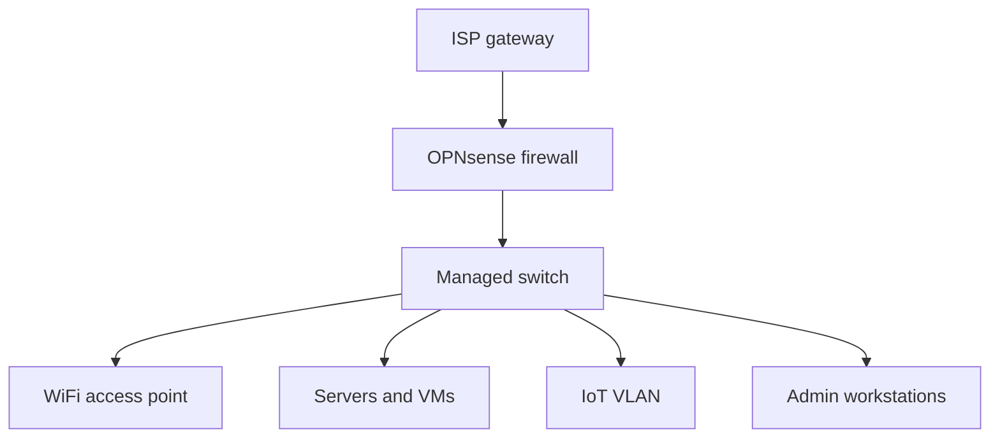

# Network topology

The lab is built around a single edge firewall so routing policy, NAT, and inspection stay in one place. Downstream gear handles switching and wireless; VLANs are defined on the firewall and carried over a trunk to the access layer.

**Edge:** OPNsense on a dedicated dual-NIC host. The WAN interface faces the ISP gateway (DHCP); the LAN side feeds a managed switch. Suricata runs here for IDS/IPS once the baseline is stable.

**Access:** A UniFi switch uplinks to the firewall (trunk if multiple VLANs, or a flat LAN during early setup). A UniFi U7 Lite access point hangs off the switch with PoE. SSIDs map to VLANs so wireless clients land in the same trust zones as wired ones.

**Segments:** Management, trusted user, servers, IoT, and guest are on separate VLANs with non-overlapping private address space. IoT and guest do not reach management or internal servers unless a rule explicitly allows it—usually DNS/NTP only where needed.

If a UniFi Cloud Gateway is used in series with OPNsense, that adds another routing hop (often double NAT). That is fine for learning if it is documented; port forwards and remote access need to be traced through both layers.

Later, traffic mirroring on the switch can feed a sensor or NSM stack for full packet capture on selected VLANs.

Details that change often (exact VLAN IDs, interface names, and addressing) stay in private runbooks and sanitized configs—not in this public repo.
