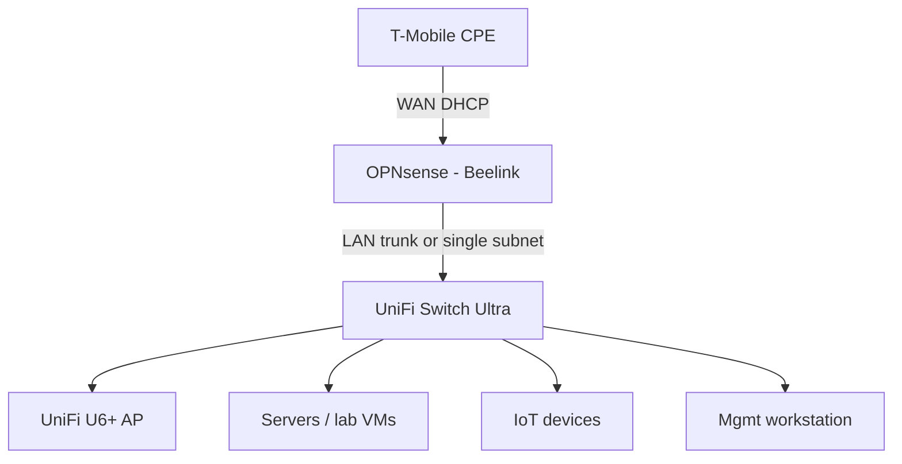

# Ideal topology

This document describes a **recommended** layout that balances your SOC/network learning goals with UniFi switching and WiFi. Adjust IPs and VLAN IDs to your environment.

## Design principles

1. **One primary router at the edge** for a clear story: policy, NAT, IDS/IPS, and VPN live in one place unless you intentionally split roles (and document why).
2. **VLANs terminate at the edge router** (OPNsense): the switch carries **802.1Q trunks**; wireless maps SSIDs to VLANs on the AP.
3. **IoT and guests** get **no route to management** by default; DNS/NTP exceptions only if required.
4. **Double NAT** (T-Mobile → OPNsense → another router) is acceptable for learning if **documented**; avoid silent “mystery” NAT.

---

## Recommended topology (OPNsense-first — aligns with your roadmap)

Use **OPNsense as the only router/firewall** at the edge. The **UniFi Switch Ultra** uplinks to OPNsense LAN; the **U6+** hangs off the switch (PoE). Run the **UniFi Network Application** (controller) as a VM or container **on the LAN** — or adopt devices to a hosted controller — so you still get full UniFi switch/AP features without a second router fighting you.

### VLAN intent (example — customize IDs)

| VLAN | Example subnet | Purpose |
|------|----------------|---------|
| MGMT | `10.10.0.0/24` | Admin access, hypervisor, switch/AP management (restrict sources). |
| LAN | `10.10.10.0/24` | Trusted users and PCs. |
| SERVERS | `10.10.20.0/24` | Nextcloud, Wazuh, Pi-hole, etc. |
| IOT | `10.10.30.0/24` | Untrusted; no access to MGMT/LAN by default. |
| GUEST | `10.10.40.0/24` | Internet-only WiFi. |

**On OPNsense:** create VLAN interfaces on the LAN parent; **gateway IP per VLAN**.  
**On UniFi:** configure networks with matching VLAN IDs; **switch port uplink** to OPNsense as **trunk (all VLANs)**; AP uses **same VLANs** per SSID.

---

## Alternative: UniFi Cloud Gateway in the path

If you want **UniFi Cloud Gateway** hardware in the rack for **UniFi OS** integration, the usual tradeoff is **two routers** unless one is in bridge/passthrough (not always available).

**Option A — Double NAT (explicit):**  
`T-Mobile → OPNsense → [Cloud Gateway WAN] → [Cloud Gateway LAN] → Switch Ultra → U6+`

- **Pros:** Keeps OPNsense as the first security hop from ISP; UCG manages UniFi devices in a familiar stack.  
- **Cons:** Double NAT on the inner network; port forwarding and VPN require careful planning. **Document every public service.**

**Option B — UniFi-only edge (simpler UniFi, less OPNsense at ISP):**  
`T-Mobile → Cloud Gateway → Switch Ultra → U6+` and OPNsense as an **internal** firewall or parallel lab (advanced).

For this portfolio’s stated goal (**OPNsense hardening first**), **Option A** or the **recommended topology** above is usually clearer than mixing two edge firewalls without a written reason.

---

## Traffic mirroring (for Suricata / Security Onion later)

If you need **full packet capture** on a segment, plan a **managed switch SPAN/mirror** session to a **sensor NIC** (document which port mirrors which VLAN).

---

## Where to document changes

Update `docs/assets.md` when hardware moves; add a short `reports/` entry whenever you change VLANs or uplink mode (trunk vs access).
